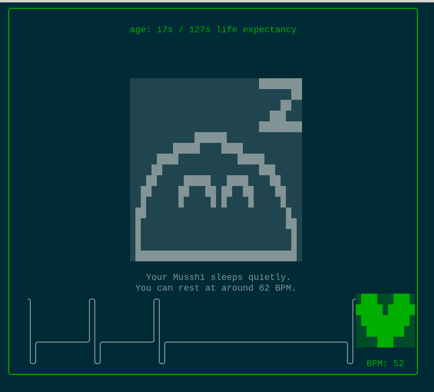

# Musshi's Heart
You drive the heart oh a little creature called: Musshi.



## Goal

Every Musshis wants to find love and die peacefully, but they are very fragile. The goal is to maintain heartbeats per minute close to the Musshi's needs. Every heart failure decrease Musshi's life expectancy. Are you gonna make it survive long enough to find love ?

## Compile & Install

```
git clone git@github.com:yanc0/musshis-heart.git
cd musshis-heart/
go build
```

## Play locally

```
ssh -p 2222 localhost
```

## Licence

This component is released to the public domain by the author.